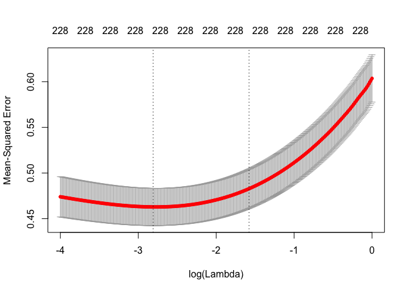
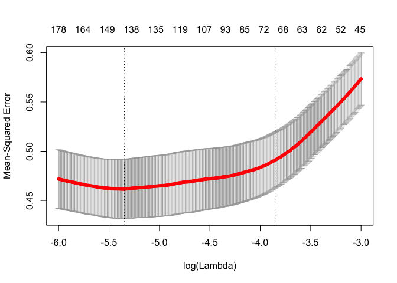

P8106\_hw1\_xy2395
================
Jack Yan
2/27/2019

``` r
knitr::opts_chunk$set(echo = TRUE)
library(tidyverse)
library(caret)
library(glmnet)
library(pls)
set.seed(123123)
```

Introduction
------------

In this homework, 4 regression methods (i.e. least squares, ridge, lasso, and PCR) are implemented to predict the solubility of compounds using their chemical structures. The test errors of the 4 models are compared.

Data Entry
----------

``` r
train_df <- 
  read_csv("./data/solubility_train.csv") %>% 
  janitor::clean_names()

test_df <- 
  read_csv("./data/solubility_test.csv") %>% 
  janitor::clean_names()
```

Model Implementation
--------------------

#### Least Squares

``` r
fit_ls = lm(solubility ~ ., data = train_df)

test_df_ls =
  modelr::add_predictions(test_df, fit_ls) %>% 
  mutate(error = solubility - pred)
mse_ls = mean(test_df_ls$error^2)
mse_ls
```

    ## [1] 0.5558898

The test mean square error for the least square model is 0.5558898.

#### Ridge Regression

``` r
x = model.matrix(solubility~., train_df)[,-1]
y = train_df %>% pull(solubility)
ridge.mod <- glmnet(x, y, alpha = 0, lambda = exp(seq(-2, 0, length = 300)))
coef(ridge.mod) %>% dim()
```

    ## [1] 229 300

``` r
cv.ridge <- cv.glmnet(x, y, 
                      alpha = 0, 
                      nfolds = 10,
                      lambda = exp(seq(-4, 0, length = 300)), 
                      type.measure = "mse")

plot(cv.ridge)
```



``` r
best_lambda_ridge <- cv.ridge$lambda.min
best_lambda_ridge
```

    ## [1] 0.06024326

The lambda corresponding to the lowest training MSE is 0.0602433.

``` r
new_x = model.matrix(solubility~., test_df)[,-1]
test_df_ridge = 
  test_df %>% 
  mutate(pred = predict(ridge.mod, s = best_lambda_ridge, newx = new_x, type = "response")) %>% 
  mutate(error = pred - solubility)

mse_ridge = mean(test_df_ridge$error^2)
mse_ridge
```

    ## [1] 0.5138249

The test mean square error for the ridge model is 0.5138249.

#### Lasso Regression

``` r
x = model.matrix(solubility~., train_df)[,-1]
y = train_df %>% pull(solubility)
lasso_mod <- glmnet(x, y, alpha = 1, lambda = exp(seq(-4, 0, length = 300)))
```

``` r
cv_lasso <- cv.glmnet(x, y, 
                      alpha = 1, 
                      nfolds = 10,
                      lambda = exp(seq(-6, -3, length = 300)), 
                      type.measure = "mse")

plot(cv_lasso)
```



``` r
best_lambda_lasso <- cv_lasso$lambda.min
best_lambda_lasso
```

    ## [1] 0.004758484

The lambda corresponding to the lowest training MSE is 0.0047585.

``` r
new_x = model.matrix(solubility~., test_df)[,-1]
test_df_lasso = 
  test_df %>% 
  mutate(pred = predict(lasso_mod, s = best_lambda_lasso, newx = new_x, type = "response")) %>% 
  mutate(error = pred - solubility)

mse_lasso = mean(test_df_lasso$error^2)
mse_lasso
```

    ## [1] 0.5333447

The test mean square error for the lasso model is 0.5333447.

``` r
n_nonzero_coef = 
  glmnet(x, y, alpha = 1, lambda = best_lambda_lasso) %>% 
  coef %>% 
  as.matrix() %>% 
  as.tibble() %>% 
  filter(s0 != 0) %>% 
  nrow()

n_nonzero_coef
```

    ## [1] 143

There are 143 non-zero coefficient estimates if we use the 'best' lambda 0.0047585.

#### Principal Component Regression

``` r
pcr_mod <- pcr(solubility~., 
               data = train_df,
               scale = TRUE, 
               validation = "CV")
# find the number of components with the lowest MSEP
pcr_mod %>% summary
```

    ## Data:    X dimension: 951 228 
    ##  Y dimension: 951 1
    ## Fit method: svdpc
    ## Number of components considered: 228
    ## 
    ## VALIDATION: RMSEP
    ## Cross-validated using 10 random segments.
    ##        (Intercept)  1 comps  2 comps  3 comps  4 comps  5 comps  6 comps
    ## CV           2.048    2.042     1.98    1.714    1.607    1.571    1.455
    ## adjCV        2.048    2.042     1.98    1.713    1.600    1.593    1.454
    ##        7 comps  8 comps  9 comps  10 comps  11 comps  12 comps  13 comps
    ## CV       1.295    1.294    1.293     1.270     1.246     1.245     1.244
    ## adjCV    1.289    1.290    1.292     1.268     1.244     1.244     1.244
    ##        14 comps  15 comps  16 comps  17 comps  18 comps  19 comps
    ## CV        1.196     1.164     1.120     1.055     1.046     1.035
    ## adjCV     1.195     1.166     1.116     1.047     1.044     1.033
    ##        20 comps  21 comps  22 comps  23 comps  24 comps  25 comps
    ## CV        1.016     1.006     1.006    0.9803    0.9781    0.9779
    ## adjCV     1.011     1.004     1.006    0.9773    0.9757    0.9754
    ##        26 comps  27 comps  28 comps  29 comps  30 comps  31 comps
    ## CV       0.9712    0.9676    0.9634    0.9610    0.9611    0.9394
    ## adjCV    0.9657    0.9643    0.9611    0.9594    0.9609    0.9379
    ##        32 comps  33 comps  34 comps  35 comps  36 comps  37 comps
    ## CV       0.9294    0.9182    0.9188    0.9080    0.8960    0.8907
    ## adjCV    0.9278    0.9154    0.9177    0.9033    0.8917    0.8864
    ##        38 comps  39 comps  40 comps  41 comps  42 comps  43 comps
    ## CV       0.8879    0.8834    0.8753    0.8703    0.8723    0.8639
    ## adjCV    0.8851    0.8833    0.8709    0.8678    0.8705    0.8674
    ##        44 comps  45 comps  46 comps  47 comps  48 comps  49 comps
    ## CV       0.8517    0.8485    0.8485    0.8406    0.8433    0.8426
    ## adjCV    0.8494    0.8448    0.8461    0.8373    0.8410    0.8404
    ##        50 comps  51 comps  52 comps  53 comps  54 comps  55 comps
    ## CV       0.8415    0.8371    0.8345    0.8324    0.8305    0.8320
    ## adjCV    0.8397    0.8347    0.8293    0.8285    0.8283    0.8299
    ##        56 comps  57 comps  58 comps  59 comps  60 comps  61 comps
    ## CV       0.8308    0.8334    0.8293    0.8256    0.8192    0.8056
    ## adjCV    0.8283    0.8335    0.8298    0.8256    0.8172    0.7997
    ##        62 comps  63 comps  64 comps  65 comps  66 comps  67 comps
    ## CV       0.8055    0.8035    0.8041    0.8032    0.8015    0.8014
    ## adjCV    0.8002    0.7991    0.8001    0.8000    0.7999    0.7975
    ##        68 comps  69 comps  70 comps  71 comps  72 comps  73 comps
    ## CV       0.7995    0.7991    0.7992    0.8005    0.7952    0.7903
    ## adjCV    0.7965    0.7956    0.7976    0.7998    0.7886    0.7858
    ##        74 comps  75 comps  76 comps  77 comps  78 comps  79 comps
    ## CV       0.7897    0.7885    0.7912    0.7920    0.7937    0.7920
    ## adjCV    0.7853    0.7848    0.7873    0.7891    0.7906    0.7879
    ##        80 comps  81 comps  82 comps  83 comps  84 comps  85 comps
    ## CV       0.7901    0.7878    0.7893    0.7862    0.7851    0.7853
    ## adjCV    0.7867    0.7839    0.7835    0.7826    0.7825    0.7811
    ##        86 comps  87 comps  88 comps  89 comps  90 comps  91 comps
    ## CV       0.7883    0.7871    0.7862    0.7828    0.7845    0.7823
    ## adjCV    0.7845    0.7835    0.7836    0.7813    0.7825    0.7778
    ##        92 comps  93 comps  94 comps  95 comps  96 comps  97 comps
    ## CV       0.7799    0.7741    0.7747    0.7743    0.7753    0.7764
    ## adjCV    0.7725    0.7679    0.7692    0.7688    0.7706    0.7730
    ##        98 comps  99 comps  100 comps  101 comps  102 comps  103 comps
    ## CV       0.7766    0.7746     0.7721     0.7700     0.7686     0.7647
    ## adjCV    0.7735    0.7724     0.7665     0.7645     0.7635     0.7607
    ##        104 comps  105 comps  106 comps  107 comps  108 comps  109 comps
    ## CV        0.7634     0.7642     0.7647     0.7629     0.7615     0.7550
    ## adjCV     0.7579     0.7587     0.7603     0.7596     0.7578     0.7478
    ##        110 comps  111 comps  112 comps  113 comps  114 comps  115 comps
    ## CV        0.7555     0.7561     0.7582     0.7556     0.7564     0.7545
    ## adjCV     0.7493     0.7509     0.7545     0.7513     0.7517     0.7513
    ##        116 comps  117 comps  118 comps  119 comps  120 comps  121 comps
    ## CV        0.7539     0.7566     0.7524     0.7519     0.7492     0.7480
    ## adjCV     0.7497     0.7540     0.7520     0.7506     0.7480     0.7415
    ##        122 comps  123 comps  124 comps  125 comps  126 comps  127 comps
    ## CV        0.7503     0.7505     0.7464     0.7455     0.7484     0.7469
    ## adjCV     0.7449     0.7441     0.7410     0.7366     0.7409     0.7411
    ##        128 comps  129 comps  130 comps  131 comps  132 comps  133 comps
    ## CV        0.7454     0.7387     0.7351     0.7313     0.7323     0.7301
    ## adjCV     0.7412     0.7349     0.7341     0.7240     0.7236     0.7241
    ##        134 comps  135 comps  136 comps  137 comps  138 comps  139 comps
    ## CV        0.7268     0.7287     0.7287     0.7297     0.7253     0.7261
    ## adjCV     0.7221     0.7252     0.7232     0.7234     0.7210     0.7229
    ##        140 comps  141 comps  142 comps  143 comps  144 comps  145 comps
    ## CV        0.7274     0.7245     0.7241     0.7210     0.7185     0.7177
    ## adjCV     0.7229     0.7173     0.7176     0.7171     0.7100     0.7106
    ##        146 comps  147 comps  148 comps  149 comps  150 comps  151 comps
    ## CV        0.7150     0.7137     0.7103     0.7093     0.7107     0.7119
    ## adjCV     0.7077     0.7070     0.7020     0.7015     0.7021     0.7039
    ##        152 comps  153 comps  154 comps  155 comps  156 comps  157 comps
    ## CV        0.7105     0.7088     0.7074     0.7102     0.7105     0.7086
    ## adjCV     0.7029     0.7012     0.7005     0.7016     0.7033     0.6997
    ##        158 comps  159 comps  160 comps  161 comps  162 comps  163 comps
    ## CV        0.7094     0.7099     0.7087     0.7114     0.7139     0.7123
    ## adjCV     0.7008     0.7016     0.7014     0.7038     0.7063     0.7050
    ##        164 comps  165 comps  166 comps  167 comps  168 comps  169 comps
    ## CV        0.7141     0.7134     0.7141     0.7161     0.7165     0.7168
    ## adjCV     0.7061     0.7062     0.7054     0.7077     0.7082     0.7088
    ##        170 comps  171 comps  172 comps  173 comps  174 comps  175 comps
    ## CV        0.7178     0.7219     0.7238     0.7245     0.7266     0.7250
    ## adjCV     0.7096     0.7136     0.7159     0.7170     0.7178     0.7171
    ##        176 comps  177 comps  178 comps  179 comps  180 comps  181 comps
    ## CV        0.7230     0.7241     0.7247     0.7246     0.7263     0.7239
    ## adjCV     0.7139     0.7150     0.7160     0.7158     0.7180     0.7142
    ##        182 comps  183 comps  184 comps  185 comps  186 comps  187 comps
    ## CV        0.7264     0.7245     0.7229     0.7242      0.723     0.7222
    ## adjCV     0.7173     0.7150     0.7138     0.7153      0.713     0.7127
    ##        188 comps  189 comps  190 comps  191 comps  192 comps  193 comps
    ## CV        0.7274     0.7277     0.7269     0.7276     0.7273     0.7278
    ## adjCV     0.7179     0.7179     0.7168     0.7179     0.7181     0.7187
    ##        194 comps  195 comps  196 comps  197 comps  198 comps  199 comps
    ## CV        0.7268     0.7260     0.7295      0.732     0.7332     0.7320
    ## adjCV     0.7174     0.7172     0.7180      0.721     0.7231     0.7228
    ##        200 comps  201 comps  202 comps  203 comps  204 comps  205 comps
    ## CV        0.7355     0.7318     0.7326     0.7296     0.7382     0.7375
    ## adjCV     0.7242     0.7215     0.7208     0.7184     0.7275     0.7264
    ##        206 comps  207 comps  208 comps  209 comps  210 comps  211 comps
    ## CV        0.7362     0.7351     0.7342     0.7319     0.7343     0.7398
    ## adjCV     0.7234     0.7235     0.7223     0.7200     0.7222     0.7275
    ##        212 comps  213 comps  214 comps  215 comps  216 comps  217 comps
    ## CV        0.7403     0.7416     0.7421     0.7410     0.7391     0.7384
    ## adjCV     0.7276     0.7291     0.7292     0.7284     0.7266     0.7250
    ##        218 comps  219 comps  220 comps  221 comps  222 comps  223 comps
    ## CV        0.7361     0.7381     0.7390     0.7408     0.7395     0.7384
    ## adjCV     0.7230     0.7251     0.7262     0.7279     0.7268     0.7250
    ##        224 comps  225 comps  226 comps  227 comps  228 comps
    ## CV        0.7397     0.7324     0.7368     0.7329  1.368e+12
    ## adjCV     0.7269     0.7192     0.7234     0.7212  1.298e+12
    ## 
    ## TRAINING: % variance explained
    ##             1 comps  2 comps  3 comps  4 comps  5 comps  6 comps  7 comps
    ## X            12.417   23.083    30.29    34.91    39.27    43.53    46.98
    ## solubility    0.734    7.182    30.52    39.36    39.52    50.82    60.83
    ##             8 comps  9 comps  10 comps  11 comps  12 comps  13 comps
    ## X             50.08    53.04     55.46     57.67     59.81     61.72
    ## solubility    61.00    61.01     62.57     64.10     64.17     64.36
    ##             14 comps  15 comps  16 comps  17 comps  18 comps  19 comps
    ## X              63.43     64.82     66.16     67.40     68.58     69.68
    ## solubility     67.12     68.79     71.69     74.75     74.96     75.59
    ##             20 comps  21 comps  22 comps  23 comps  24 comps  25 comps
    ## X              70.73     71.76     72.72     73.64     74.48     75.31
    ## solubility     76.72     76.96     77.00     78.34     78.40     78.48
    ##             26 comps  27 comps  28 comps  29 comps  30 comps  31 comps
    ## X              76.09     76.85     77.57     78.29     78.95     79.59
    ## solubility     78.97     79.03     79.20     79.42     79.43     80.34
    ##             32 comps  33 comps  34 comps  35 comps  36 comps  37 comps
    ## X              80.22     80.81     81.38     81.92     82.46     82.96
    ## solubility     80.94     81.52     81.53     82.15     82.66     82.96
    ##             38 comps  39 comps  40 comps  41 comps  42 comps  43 comps
    ## X              83.45     83.92     84.37     84.82     85.23     85.64
    ## solubility     82.97     82.98     83.49     83.58     83.61     83.73
    ##             44 comps  45 comps  46 comps  47 comps  48 comps  49 comps
    ## X              86.03     86.42     86.78     87.13     87.46     87.77
    ## solubility     84.41     84.54     84.56     84.82     84.82     84.93
    ##             50 comps  51 comps  52 comps  53 comps  54 comps  55 comps
    ## X              88.08     88.39     88.68     88.97     89.25     89.52
    ## solubility     84.99     85.19     85.46     85.48     85.55     85.57
    ##             56 comps  57 comps  58 comps  59 comps  60 comps  61 comps
    ## X              89.77     90.02     90.26     90.51     90.75     90.97
    ## solubility     85.61     85.62     85.70     85.89     86.12     86.61
    ##             62 comps  63 comps  64 comps  65 comps  66 comps  67 comps
    ## X              91.19     91.41     91.62     91.83     92.03     92.23
    ## solubility     86.65     86.66     86.66     86.67     86.69     86.82
    ##             68 comps  69 comps  70 comps  71 comps  72 comps  73 comps
    ## X              92.42     92.60     92.77     92.95     93.12     93.28
    ## solubility     86.83     86.92     86.94     87.00     87.45     87.48
    ##             74 comps  75 comps  76 comps  77 comps  78 comps  79 comps
    ## X              93.44     93.60     93.76     93.91     94.06     94.20
    ## solubility     87.50     87.51     87.55     87.57     87.62     87.74
    ##             80 comps  81 comps  82 comps  83 comps  84 comps  85 comps
    ## X              94.34     94.47     94.61     94.74     94.86     94.99
    ## solubility     87.76     87.83     87.95     87.95     88.00     88.11
    ##             86 comps  87 comps  88 comps  89 comps  90 comps  91 comps
    ## X              95.11     95.22     95.34     95.45     95.56     95.66
    ## solubility     88.11     88.13     88.14     88.14     88.23     88.41
    ##             92 comps  93 comps  94 comps  95 comps  96 comps  97 comps
    ## X              95.77     95.87     95.97     96.07     96.16     96.26
    ## solubility     88.60     88.67     88.68     88.71     88.72     88.72
    ##             98 comps  99 comps  100 comps  101 comps  102 comps  103 comps
    ## X              96.35     96.44      96.53      96.61      96.70      96.78
    ## solubility     88.74     88.74      88.94      88.97      89.02      89.12
    ##             104 comps  105 comps  106 comps  107 comps  108 comps
    ## X               96.86      96.94      97.02      97.09      97.17
    ## solubility      89.30      89.33      89.33      89.34      89.39
    ##             109 comps  110 comps  111 comps  112 comps  113 comps
    ## X               97.24      97.31      97.38      97.45      97.51
    ## solubility      89.62      89.64      89.65      89.66      89.77
    ##             114 comps  115 comps  116 comps  117 comps  118 comps
    ## X               97.58      97.64      97.70      97.76      97.82
    ## solubility      89.81      89.81      89.87      89.88      89.88
    ##             119 comps  120 comps  121 comps  122 comps  123 comps
    ## X               97.88      97.94      98.00      98.05      98.11
    ## solubility      90.00      90.06      90.34      90.36      90.44
    ##             124 comps  125 comps  126 comps  127 comps  128 comps
    ## X               98.16      98.21      98.26      98.31      98.36
    ## solubility      90.49      90.67      90.69      90.70      90.70
    ##             129 comps  130 comps  131 comps  132 comps  133 comps
    ## X               98.41      98.45      98.50      98.54      98.59
    ## solubility      90.79      90.79      91.14      91.24      91.25
    ##             134 comps  135 comps  136 comps  137 comps  138 comps
    ## X               98.63      98.67      98.71      98.75      98.79
    ## solubility      91.25      91.25      91.34      91.39      91.41
    ##             139 comps  140 comps  141 comps  142 comps  143 comps
    ## X               98.82      98.86      98.89      98.93      98.96
    ## solubility      91.42      91.49      91.63      91.65      91.65
    ##             144 comps  145 comps  146 comps  147 comps  148 comps
    ## X               99.00      99.03      99.06      99.09      99.12
    ## solubility      91.91      91.91      91.96      91.97      92.06
    ##             149 comps  150 comps  151 comps  152 comps  153 comps
    ## X               99.15      99.18      99.20      99.23      99.26
    ## solubility      92.06      92.12      92.12      92.12      92.15
    ##             154 comps  155 comps  156 comps  157 comps  158 comps
    ## X               99.28      99.31      99.33      99.35      99.38
    ## solubility      92.16      92.26      92.26      92.35      92.37
    ##             159 comps  160 comps  161 comps  162 comps  163 comps
    ## X               99.40      99.42      99.44      99.46      99.48
    ## solubility      92.37      92.37      92.40      92.41      92.41
    ##             164 comps  165 comps  166 comps  167 comps  168 comps
    ## X               99.50      99.52      99.54      99.56      99.57
    ## solubility      92.47      92.47      92.53      92.54      92.55
    ##             169 comps  170 comps  171 comps  172 comps  173 comps
    ## X               99.59      99.61      99.62      99.64      99.65
    ## solubility      92.55      92.57      92.58      92.58      92.58
    ##             174 comps  175 comps  176 comps  177 comps  178 comps
    ## X               99.67      99.68       99.7      99.71      99.73
    ## solubility      92.64      92.64       92.7      92.72      92.72
    ##             179 comps  180 comps  181 comps  182 comps  183 comps
    ## X               99.74      99.75      99.76      99.77      99.79
    ## solubility      92.76      92.76      92.84      92.84      92.89
    ##             184 comps  185 comps  186 comps  187 comps  188 comps
    ## X                99.8      99.81      99.82      99.83      99.84
    ## solubility       92.9      92.92      92.98      92.98      92.99
    ##             189 comps  190 comps  191 comps  192 comps  193 comps
    ## X               99.85      99.86      99.86      99.87      99.88
    ## solubility      93.00      93.02      93.02      93.02      93.03
    ##             194 comps  195 comps  196 comps  197 comps  198 comps
    ## X               99.89      99.90      99.90      99.91      99.92
    ## solubility      93.07      93.11      93.24      93.24      93.25
    ##             199 comps  200 comps  201 comps  202 comps  203 comps
    ## X               99.92      99.93      99.94      99.94      99.95
    ## solubility      93.26      93.35      93.35      93.42      93.42
    ##             204 comps  205 comps  206 comps  207 comps  208 comps
    ## X               99.95      99.96      99.96      99.97      99.97
    ## solubility      93.42      93.48      93.57      93.57      93.65
    ##             209 comps  210 comps  211 comps  212 comps  213 comps
    ## X               99.97      99.98      99.98      99.98      99.99
    ## solubility      93.69      93.70      93.70      93.73      93.73
    ##             214 comps  215 comps  216 comps  217 comps  218 comps
    ## X               99.99      99.99      99.99      99.99      99.99
    ## solubility      93.76      93.78      93.82      93.88      93.90
    ##             219 comps  220 comps  221 comps  222 comps  223 comps
    ## X              100.00     100.00     100.00     100.00     100.00
    ## solubility      93.92      93.93      93.94      93.97      94.04
    ##             224 comps  225 comps  226 comps  227 comps  228 comps
    ## X              100.00     100.00     100.00     100.00     100.00
    ## solubility      94.04      94.16      94.16      94.16      94.46

``` r
pcr_mod %>% 
  MSEP %>% # extract the object VALIDATION: RMSEP
  .[[1]] %>% # extract the array from the object
  .[2,,] %>% # extract the CV MESP(numeric) from the array
  as.list %>% as.tibble() %>% # coerce to tibble
  gather(key = 'ncomp', value = 'msep', `(Intercept)`: `228 comps`) %>% 
  arrange(msep) # sort by MSEP to find the best M
```

    ## # A tibble: 229 x 2
    ##    ncomp      msep
    ##    <chr>     <dbl>
    ##  1 157 comps 0.490
    ##  2 154 comps 0.491
    ##  3 158 comps 0.491
    ##  4 153 comps 0.492
    ##  5 160 comps 0.492
    ##  6 149 comps 0.492
    ##  7 159 comps 0.492
    ##  8 155 comps 0.492
    ##  9 148 comps 0.493
    ## 10 150 comps 0.493
    ## # ... with 219 more rows

The number of M is 166.

``` r
pcr_pred = predict(pcr_mod, test_df, ncomp = 166)

mse_pcr = mean((pcr_pred - test_df$solubility)^2)
mse_pcr
```

    ## [1] 0.5237458

The test MSE for the PCR model is 0.5237458, with M = 166.

Discussion
----------

The MSE's for the 4 models are summarized below.

|          Model|   Test MSE|
|--------------:|----------:|
|  Least Squares|  0.5558898|
|          Ridge|  0.5138249|
|          Lasso|  0.5333447|
|            PCR|  0.5237458|

With this data set, the Ridge regression has the lowest test MSE, and as expected, the ordinary Least squares regression has the highest test MSE. The Ridge, Lasso and PCR regression use regularization or dimension reduction techniques to decrease the variability in coefficients, so they perform better than the ordinary least squares regression.

We use cross-validation extensively throughout the homework. It is a powerful tool in selecting tuning parameters as well as measuring model predictability.
