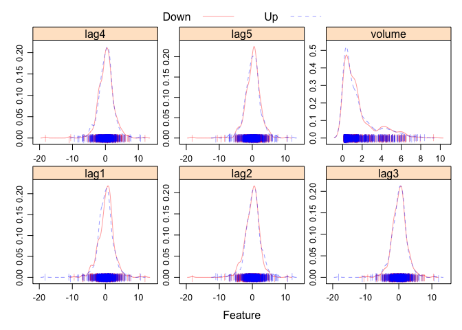
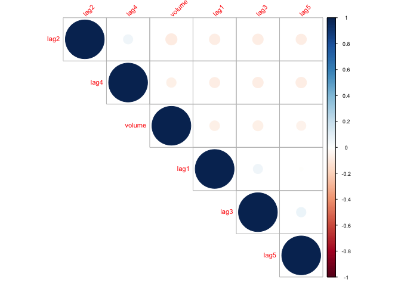
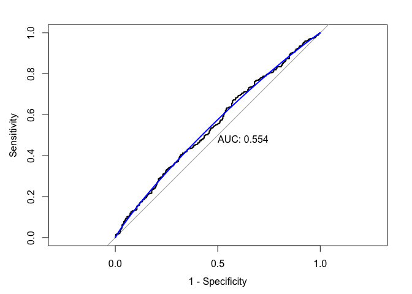
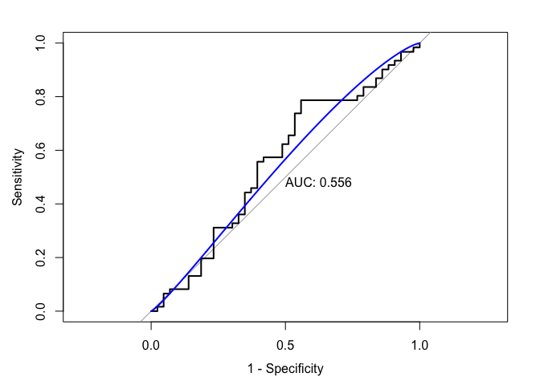
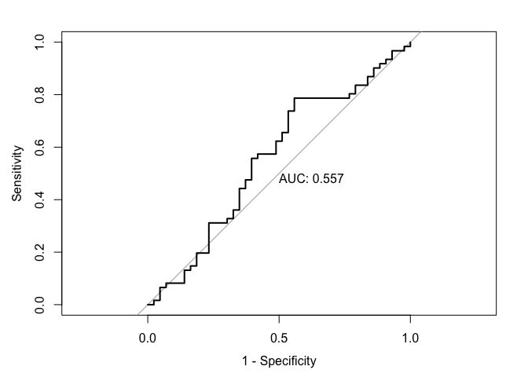
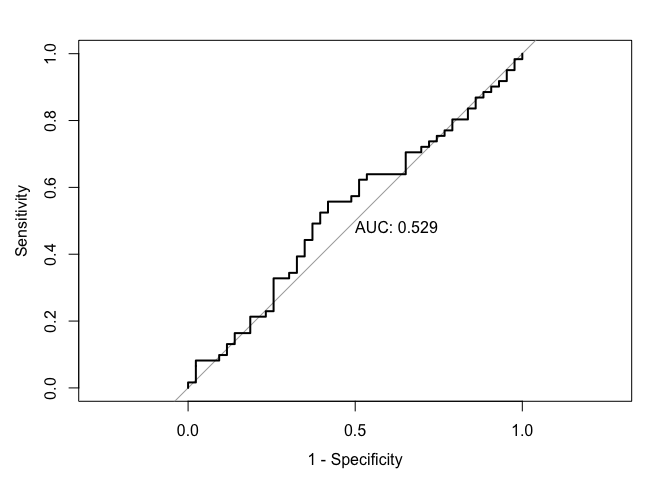
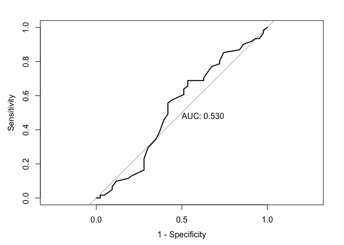
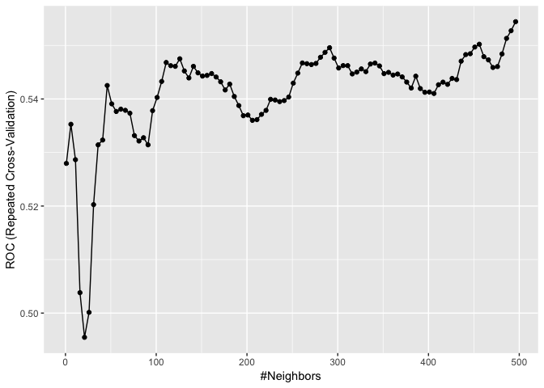

P8106\_hw3\_xy2395
================
Jack Yan
4/9/2019

Data Import
-----------

``` r
data(Weekly)
weekly <-
  Weekly %>% 
  as.tibble() %>% 
  clean_names() %>% 
  # set 'Down' as reference group
  mutate(direction = fct_relevel(direction, 'Down', 'Up')) %>% 
  dplyr::select(-today, -year)
```

(a) Graphical Summary
---------------------

``` r
# Distribution of response classes with regard to each variable
transparentTheme(trans = .4)
featurePlot(x = weekly[,-7], 
            y = weekly$direction,
            scales = list(x = list(relation="free"), 
                          y = list(relation="free")),
            plot = "density", pch = "|", 
            auto.key = list(columns = 2))
```



``` r
# Correlation plot of variables 
par(cex = 0.7)
corrplot(cor(weekly[,-7]), tl.srt = 45, order = 'hclust', type = 'upper')
```



The distribution of response classes (up and down) is highly overlapping with regard to each predictor, so it is infeasible to predict the response based on any single feature. As the correlation plot shows, the pairwise correlation among predictors appears to be trivial.

(b) Logistic Regression
-----------------------

``` r
# fit a logistic regression model 
fit_glm = glm(direction~.,
              data = weekly,
              family = binomial)
contrasts(weekly$direction)
```

    ##      Up
    ## Down  0
    ## Up    1

``` r
# print model coefficients and p-values
fit_glm %>% 
  broom::tidy() %>% 
  knitr::kable()
```

| term        |    estimate|  std.error|   statistic|    p.value|
|:------------|-----------:|----------:|-----------:|----------:|
| (Intercept) |   0.2668641|  0.0859296|   3.1056134|  0.0018988|
| lag1        |  -0.0412689|  0.0264103|  -1.5626099|  0.1181444|
| lag2        |   0.0584417|  0.0268650|   2.1753839|  0.0296014|
| lag3        |  -0.0160611|  0.0266630|  -0.6023760|  0.5469239|
| lag4        |  -0.0277902|  0.0264633|  -1.0501409|  0.2936533|
| lag5        |  -0.0144721|  0.0263848|  -0.5485006|  0.5833482|
| volume      |  -0.0227415|  0.0368981|  -0.6163330|  0.5376748|

Among all the predictors, only `lag2` appears to be significant at the significance level of 0.05.

(c) Confusion Matrix
--------------------

``` r
pred_prob = predict(fit_glm, type = "response")
pred_class = 
  if_else(pred_prob > 0.5, 'Up', 'Down') %>% 
  as_factor() %>% 
  fct_relevel('Down', 'Up')

# confusion matrix
confusionMatrix(data = pred_class,
                reference = weekly$direction,
                positive = 'Up')
```

    ## Confusion Matrix and Statistics
    ## 
    ##           Reference
    ## Prediction Down  Up
    ##       Down   54  48
    ##       Up    430 557
    ##                                          
    ##                Accuracy : 0.5611         
    ##                  95% CI : (0.531, 0.5908)
    ##     No Information Rate : 0.5556         
    ##     P-Value [Acc > NIR] : 0.369          
    ##                                          
    ##                   Kappa : 0.035          
    ##  Mcnemar's Test P-Value : <2e-16         
    ##                                          
    ##             Sensitivity : 0.9207         
    ##             Specificity : 0.1116         
    ##          Pos Pred Value : 0.5643         
    ##          Neg Pred Value : 0.5294         
    ##              Prevalence : 0.5556         
    ##          Detection Rate : 0.5115         
    ##    Detection Prevalence : 0.9063         
    ##       Balanced Accuracy : 0.5161         
    ##                                          
    ##        'Positive' Class : Up             
    ## 

``` r
# Overall fraction of correct predictions
mean(pred_class == weekly$direction)
```

    ## [1] 0.5610652

The overall fraction of correct predictions is 0.56, and Kappa coefficient given by confusion matrix is 0.035. Kappa is a measure of how the classification results compare to values assigned by chance. Kappa = 0.035 tells us that the prediction is positively correlated with the truth, but not very accurate. Also, PPV = 0.5643 and NPV = 0.5294, which are slightly bette than a random guess. The proportion of true positive responses among the positive predictions is 0.5643. The proportion of true negative responses among the negative predictions is 0.5294.

(d) ROC Curve for logistic regression
-------------------------------------

``` r
roc_glm = roc(weekly$direction, pred_prob)
plot.roc(roc_glm, legacy.axes = TRUE, print.auc = TRUE) 
plot.roc(smooth(roc_glm), col = 4, add = TRUE)
```



We plot the ROC curve using the predicted probability from logistic regression. The area under curve (AUC) is 0.554.

(e) Test ROC of logistic regression
-----------------------------------

Fit a logistic regression model using a training data from 1990 to 2008, with `lag1` and `lag2` as the predictors. Plot the ROC curve using the held out data.

``` r
# train set
train_df <-
  Weekly %>% 
  as.tibble() %>% 
  clean_names() %>% 
  mutate(direction = fct_relevel(direction, 'Down', 'Up')) %>% 
  # use data from 1990 - 2008
  filter(year < 2009) %>% 
  dplyr::select(-today, -year)

# test set
test_df = anti_join(weekly, train_df)
```

    ## Joining, by = c("lag1", "lag2", "lag3", "lag4", "lag5", "volume", "direction")

``` r
train_glm = glm(direction ~ lag1 + lag2,
                family = binomial,
                data = train_df)

test_prob = predict(train_glm, newdata = test_df, type =  'response')
roc_test = roc(test_df$direction, test_prob)
plot.roc(roc_test, legacy.axes = TRUE, print.auc = TRUE) 
plot.roc(smooth(roc_test), col = 4, add = TRUE)
```



The AUC for logistic regression is 0.556.

(f) LDA and QDA
---------------

#### LDA

``` r
# LDA
fit_lda <- lda(direction ~ lag1 + lag2, 
               data = train_df)

pred_lda = predict(fit_lda, newdata = test_df)

roc.lda <- roc(test_df$direction, pred_lda$posterior[,2],
               levels = c("Down", "Up"))

plot(roc.lda, legacy.axes = TRUE, print.auc = TRUE)
```



The AUC for LDA model is 0.557.

#### QDA

``` r
# QDA
fit_qda = qda(direction ~ lag1 + lag2,
              data = train_df)

pred_qda = predict(fit_qda, newdata = test_df)
roc_qda <- roc(test_df$direction, pred_qda$posterior[,2],
               levels = c("Down", "Up"))
plot.roc(roc_qda, legacy.axes = TRUE, print.auc = TRUE)
```



The AUC for QDA is 0.529.

(g) KNN
-------

``` r
set.seed(12312)
ctrl <- trainControl(method = "repeatedcv",
                     repeats = 5,
                     summaryFunction = twoClassSummary,
                     classProbs = TRUE) 

model.knn <- train(x = train_df[,1:2],
                   y = train_df$direction,
                   method = "knn",
                   preProcess = c("center", "scale"), 
                   tuneGrid = data.frame(k = seq(1, 499, by = 5)),  
                   trControl = ctrl)
```

``` r
model.knn$bestTune
```

    ##       k
    ## 100 496

``` r
pred_knn = predict.train(model.knn, newdata = test_df, type = 'prob')
roc_knn <- roc(test_df$direction, pred_knn[,2],
               levels = c("Down", "Up"))
plot.roc(roc_knn, legacy.axes = TRUE, print.auc = TRUE)
```



The AUC for KNN is 0.53.

``` r
ggplot(model.knn)
```



Here the best Tuning parameter chosen by cross-validation is k = 496. However, as the plot shows, the ROC for KNN is not stable, taking local maximum at various k values. The local maximum tend to increase with k. Due to the restriction imposed by R, `tuneGrid` of k can only range from 1 to 500 in `train` function, so we don't know if the cross-validated ROC can be even larger for k &gt; 500. Even if we obtained the k &gt; 500 that maximizes cross-validated ROC, there is no guarantee that we can get a better test AUC, since the optimal k chosen is highly variable for different seeds, and the KNN model itself is not stable for this data.

**Summary:**

Using `lag1` and `lag2` as predictors, the AUC for the models built above are summarized below.

| model    |     AUC|
|:---------|-------:|
| logistic |   0.554|
| LDA      |   0.557|
| QDA      |   0.529|
| KNN      |  0.5295|

If we train models using data from 1990 to 2008 and predict `direction` from 2009 to 2010, LDA has the largest AUC, thus generating the best prediction. However, the AUC for the above 4 models are similar and are only slightly greater than 0.5, indicating that the response `direction` is hard to be correctly classified with the given predictors. The AUC for logistic regression, LDA and QDA is stable because there is no tuning parameter involved. The KNN method, however, is not stable for this kind of data, and it is really due to chance if we can get a KNN prediction better than other models.
