P8106\_hw4\_xy2395
================
Jack Yan
4/16/2019

``` r
knitr::opts_chunk$set(echo = TRUE)
library(tidyverse) # data manipulation
library(lasso2) # data Problem 1
library(ISLR) # data Problem 2
library(rpart) # CART
library(rpart.plot)
library(caret) # model tuning
library(ranger) # much faster than RandomForest
library(patchwork)

# parallel processing with caret
library(doParallel)
cluster <- makePSOCKcluster(6)
registerDoParallel(cluster)
```

Problem 1
=========

### (a) Regression Tree

Fit a regression tree with lpsa as the response and the other variables as predictors.

``` r
set.seed(1)
data(Prostate)
tree_rpart = rpart(lpsa~., data = Prostate, cp = 0) 
rpart.plot(tree_rpart)
```

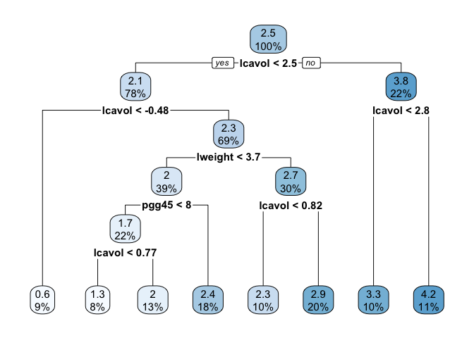

``` r
# Show cross-validation error
cpTable <- printcp(tree_rpart) 
```

    ## 
    ## Regression tree:
    ## rpart(formula = lpsa ~ ., data = Prostate, cp = 0)
    ## 
    ## Variables actually used in tree construction:
    ## [1] lcavol  lweight pgg45  
    ## 
    ## Root node error: 127.92/97 = 1.3187
    ## 
    ## n= 97 
    ## 
    ##         CP nsplit rel error  xerror     xstd
    ## 1 0.347108      0   1.00000 1.01687 0.163742
    ## 2 0.184647      1   0.65289 0.89137 0.112926
    ## 3 0.059316      2   0.46824 0.81363 0.111838
    ## 4 0.034756      3   0.40893 0.70667 0.092263
    ## 5 0.034609      4   0.37417 0.70171 0.090879
    ## 6 0.021564      5   0.33956 0.69128 0.090257
    ## 7 0.021470      6   0.31800 0.67139 0.080849
    ## 8 0.000000      7   0.29653 0.64018 0.081282

``` r
# Plot cross-validation error with different tree sizes
plotcp(tree_rpart)
```

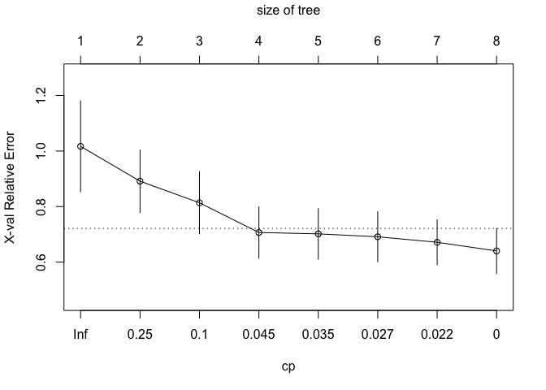

``` r
minErr <- which.min(cpTable[,4]); minErr
```

    ## 8 
    ## 8

``` r
one_se = cpTable[cpTable[,4] < cpTable[minErr,4] + cpTable[minErr,5],1][1]; one_se
```

    ##          4 
    ## 0.03475635

The Tree size corresponding to the lowest cross-validation error is 8, while the tree size obtained by 1SE rule is 4. Therefore, the tree sizes obtained by the two rules are different. 1SE rule generally generates smaller trees.

### (b) Plotting Regression Tree

Create a plot of the final tree. The 1SE rule is used.

``` r
# use 1SE rule
tree_pruned = prune(tree_rpart, cp = one_se)
rpart.plot(tree_pruned)
```

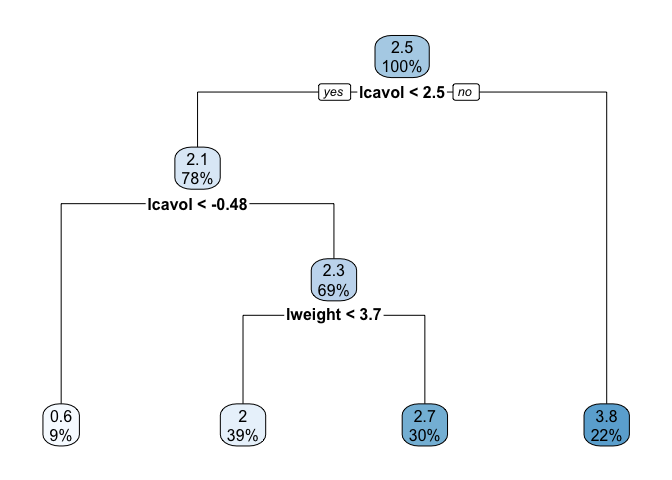

1 SE rule was used to prune the regression tree. We got a tree with size 4. The interpretation of the bottom right terminal node is that for observations with `lcavol` (log cancer volume) &gt;= 2.5, the value of response (log prostate specific antigen) is predicted to be 3.8.

### (c) Bagging and variable importance

``` r
# For bagging, don't have to tune
# fit the bagging model
bagging <- ranger(lpsa~., Prostate,
                  mtry = 8,
                  importance = "permutation",
                  min.node.size = 25,
                  scale.permutation.importance = TRUE)
barplot(sort(ranger::importance(bagging), decreasing = FALSE), 
        las = 2, horiz = TRUE, cex.names = 0.7,
        col = colorRampPalette(colors = c("darkred","white","darkblue"))(19))
```

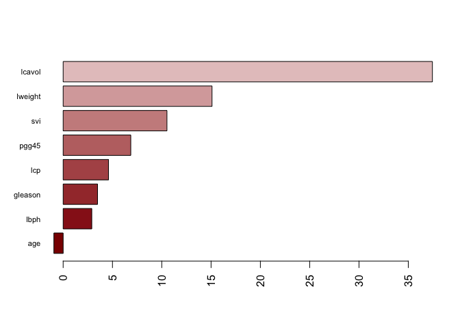

For bagging, we don't have to tune the `mtry` parameter. We set `min.node.size` to be 25. The variable importance plot is shown above. `lcavol` is the most important predictor, and `lweight` is the second most important one.

### (d) Random Forest

``` r
set.seed(1)
ctrl <- trainControl(method = "cv")
# Tune the Random Forest model
rf.grid <- expand.grid(mtry = 1:8, 
                       splitrule = "variance",
                       min.node.size = 1:30)
rf.fit <- train(lpsa~., Prostate,
                method = "ranger",
                tuneGrid = rf.grid,
                trControl = ctrl)
```

``` r
rf.fit$bestTune
```

    ##     mtry splitrule min.node.size
    ## 100    4  variance            10

``` r
ggplot(rf.fit, highlight = TRUE)
```

    ## Warning: The shape palette can deal with a maximum of 6 discrete values
    ## because more than 6 becomes difficult to discriminate; you have 8.
    ## Consider specifying shapes manually if you must have them.

    ## Warning: Removed 60 rows containing missing values (geom_point).

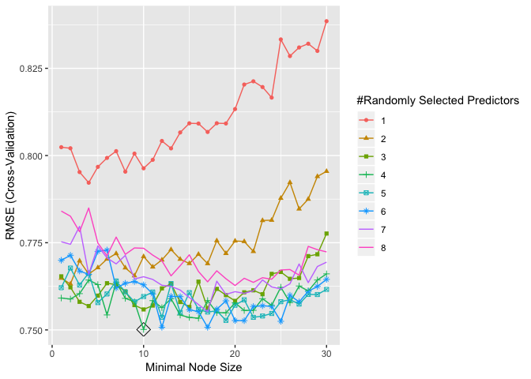

``` r
# Fit a random forest model using the best tuning parameters
rf <- ranger(lpsa~., Prostate,
             mtry = 4,
             min.node.size = 10,
             importance = "permutation",
             scale.permutation.importance = TRUE)
barplot(sort(ranger::importance(rf), decreasing = FALSE), 
        las = 2, horiz = TRUE, cex.names = 0.7,
        col = colorRampPalette(colors = c("darkred","white","darkblue"))(19))
```

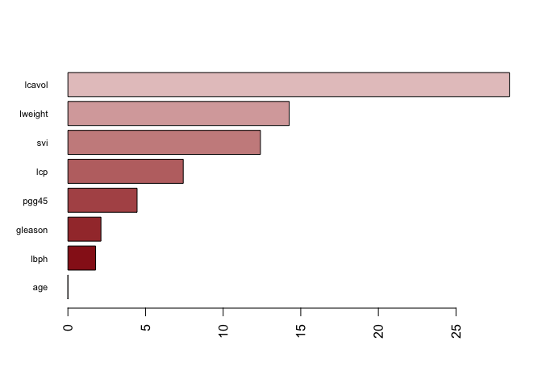 The best tuning parameter is `mtry` = 4 and `min.node.size` = 10. As shown in the plot, `lcavol` is the most important predictor. `lweight` and `svi` are 2nd and 3rd important variables.

### (e) Boosting

``` r
set.seed(1)
# Tune the boosting model
gbm.grid <- expand.grid(n.trees = c(2000,2250,2500,2750,3000),
                        interaction.depth = 1:3,
                        shrinkage = c(0.002, 0.0025, 0.003, 0.0035, 0.004, 0.0045),
                        n.minobsinnode = 1)

gbm.fit <- train(lpsa~., Prostate,
                 method = "gbm",
                 tuneGrid = gbm.grid,
                 trControl = ctrl,
                 verbose = FALSE)
```

``` r
ggplot(gbm.fit, highlight = TRUE)
```

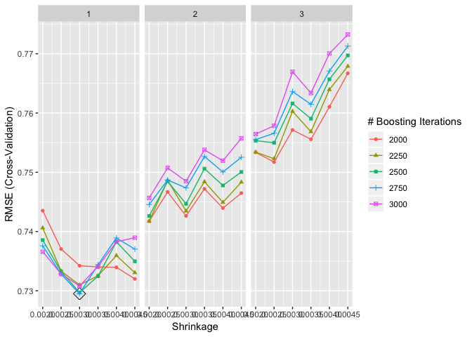

``` r
gbm.fit$bestTune
```

    ##    n.trees interaction.depth shrinkage n.minobsinnode
    ## 34    2750                 1     0.003              1

``` r
# variable importance
summary(gbm.fit$finalModel, las = 2, cBars = 19, cex.names = 0.6)
```

    ##                   Length Class      Mode     
    ## initF                1   -none-     numeric  
    ## fit                 97   -none-     numeric  
    ## train.error       2750   -none-     numeric  
    ## valid.error       2750   -none-     numeric  
    ## oobag.improve     2750   -none-     numeric  
    ## trees             2750   -none-     list     
    ## c.splits             0   -none-     list     
    ## bag.fraction         1   -none-     numeric  
    ## distribution         1   -none-     list     
    ## interaction.depth    1   -none-     numeric  
    ## n.minobsinnode       1   -none-     numeric  
    ## num.classes          1   -none-     numeric  
    ## n.trees              1   -none-     numeric  
    ## nTrain               1   -none-     numeric  
    ## train.fraction       1   -none-     numeric  
    ## response.name        1   -none-     character
    ## shrinkage            1   -none-     numeric  
    ## var.levels           8   -none-     list     
    ## var.monotone         8   -none-     numeric  
    ## var.names            8   -none-     character
    ## var.type             8   -none-     numeric  
    ## verbose              1   -none-     logical  
    ## data                 6   -none-     list     
    ## xNames               8   -none-     character
    ## problemType          1   -none-     character
    ## tuneValue            4   data.frame list     
    ## obsLevels            1   -none-     logical  
    ## param                1   -none-     list

For the boosting model, the best model has `interaction depth` = 1 and `shrinkage` = 0.003, adding up 2750 trees. `lcavol` is the most important predictor, followed by `lweight` and `lcp`.

### (e) Comparing models

``` r
resamp <- resamples(list(rf = rf.fit, gbm = gbm.fit))
summary(resamp)
```

    ## 
    ## Call:
    ## summary.resamples(object = resamp)
    ## 
    ## Models: rf, gbm 
    ## Number of resamples: 10 
    ## 
    ## MAE 
    ##          Min.   1st Qu.    Median      Mean   3rd Qu.      Max. NA's
    ## rf  0.4648123 0.5532836 0.5923967 0.6228087 0.6289865 0.9996566    0
    ## gbm 0.4131232 0.4923112 0.5553602 0.5998126 0.6677754 0.8791101    0
    ## 
    ## RMSE 
    ##          Min.   1st Qu.    Median      Mean   3rd Qu.      Max. NA's
    ## rf  0.5069939 0.6481243 0.7445905 0.7501187 0.8306560 1.1044344    0
    ## gbm 0.5009410 0.6556242 0.6982477 0.7295008 0.7876015 0.9928077    0
    ## 
    ## Rsquared 
    ##          Min.   1st Qu.    Median      Mean   3rd Qu.      Max. NA's
    ## rf  0.2238620 0.5884224 0.6716335 0.6285596 0.7076104 0.7970210    0
    ## gbm 0.3692619 0.5890270 0.6976697 0.6500616 0.7397627 0.7964835    0

``` r
ggplot(resamp) + theme_bw()
```

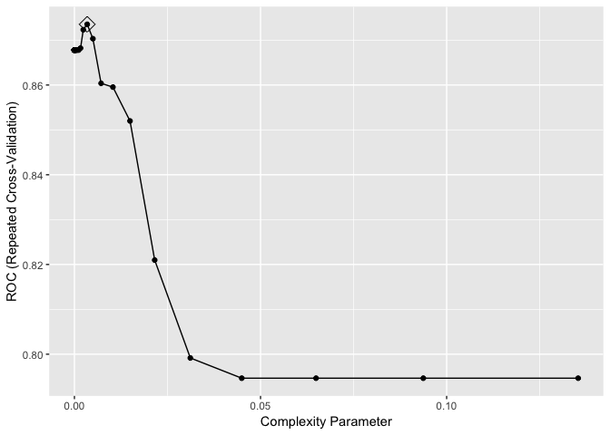 Bagging is a special case of random forest in which mtry = total number of predictors = 8. According to the tuning of random forest, the best mtry = 4, so apparently random forest is better than bagging.

Here we compare the cross-validation RMSE of random forest and boosting. I will choose the boosting model to predict PSA level, because boosting has lower cross-validation RMSE than that of random forest, indicating the best prediction accuracy.

Problem 2
=========

Create a training set containing a random sample of 800 observations, and a test set containing the remaining observations. Use set.seed() for reproducible results.

``` r
data(OJ)

oj <-
  as.tibble(OJ) %>% 
  mutate(Store7 = recode(Store7, '1' = 'Yes', '2' = 'No'),
         Store7 = as.numeric(Store7))

#split the data into training and test sets
set.seed(1)
rowTrain <- createDataPartition(y = oj$Purchase,
                                p = 799/1070,
                                list = FALSE)
train_df = oj[rowTrain,]
test_df = oj[-rowTrain,]
dim(train_df)
```

    ## [1] 800  18

### (a) Classification Tree

``` r
ctrl <- trainControl(method = "repeatedcv",
                     summaryFunction = twoClassSummary,
                     classProbs = TRUE)

set.seed(1)
rpart.fit <- train(Purchase~., train_df, 
                   method = "rpart",
                   tuneGrid = data.frame(cp = exp(seq(-20,-2, len = 50))),
                   trControl = ctrl,
                   metric = "ROC")
```

``` r
rpart.fit$bestTune
```

    ##             cp
    ## 40 0.003435924

``` r
# Model tuning
ggplot(rpart.fit, highlight = TRUE)
```

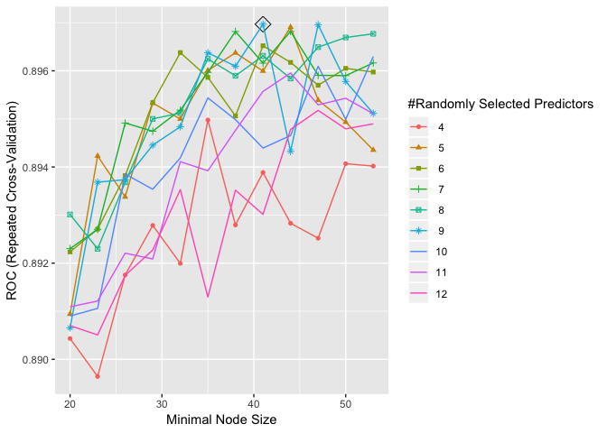

``` r
# Plot of the final model
rpart.plot(rpart.fit$finalModel)
```

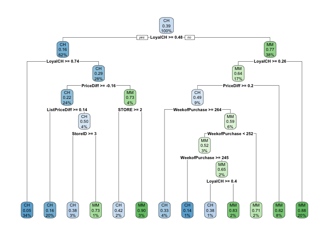

The plot of the final model is shown above.

``` r
test_df$probCH = predict(rpart.fit$finalModel, newdata = test_df, type = "prob")[,1]
test_df$pred = if_else(test_df$probCH > 0.5, 'CH', 'MM')

# Classification error rate
1 - mean(test_df$pred == test_df$Purchase)
```

    ## [1] 0.2148148

Test classification error rate of classification tree is 0.2148148.

### (b) Random Forests

``` r
rf.grid <- expand.grid(mtry = seq(4,12, by=1),
                       splitrule = "gini",
                       min.node.size = seq(20,55, by=3))
set.seed(1)
rf.fit <- train(Purchase~., train_df,
                method = "ranger",
                tuneGrid = rf.grid,
                metric = "ROC",
                trControl = ctrl)
```

``` r
rf.fit$bestTune
```

    ##    mtry splitrule min.node.size
    ## 68    9      gini            41

``` r
ggplot(rf.fit, highlight = TRUE)
```

    ## Warning: The shape palette can deal with a maximum of 6 discrete values
    ## because more than 6 becomes difficult to discriminate; you have 9.
    ## Consider specifying shapes manually if you must have them.

    ## Warning: Removed 36 rows containing missing values (geom_point).

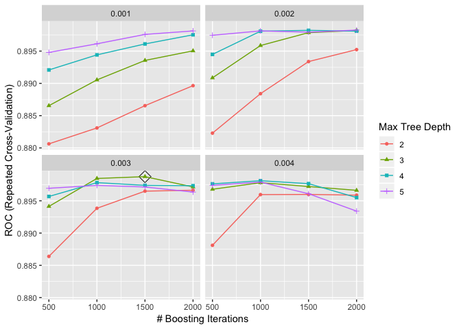

``` r
rf.pred <- predict(rf.fit, newdata = test_df, type = "prob")[,1]
pred_rf = if_else(rf.pred > 0.5, 'CH', 'MM')
# Classification error rate
1 - mean(pred_rf == test_df$Purchase)
```

    ## [1] 0.1888889

The test classification error rate for random forest is 0.1888889.

##### Variable Importance

``` r
set.seed(1)

rf2.final.per <- ranger(Purchase~., train_df, 
                        mtry = 9, 
                        min.node.size = 41,
                        splitrule = "gini",
                        importance = "permutation",
                        scale.permutation.importance = TRUE) 

barplot(sort(ranger::importance(rf2.final.per), decreasing = FALSE), 
        las = 2, horiz = TRUE, cex.names = 0.7,
        col = colorRampPalette(colors = c("cyan","blue"))(8))
```

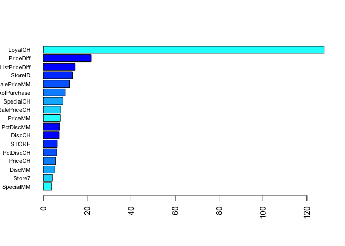

``` r
set.seed(1)
rf2.final.imp <- ranger(Purchase~., train_df, 
                        mtry = 9, 
                        splitrule = "gini",
                        min.node.size = 41,
                        importance = "impurity") 

barplot(sort(ranger::importance(rf2.final.imp), decreasing = FALSE), 
        las = 2, horiz = TRUE, cex.names = 0.7,
        col = colorRampPalette(colors = c("cyan","blue"))(8))
```

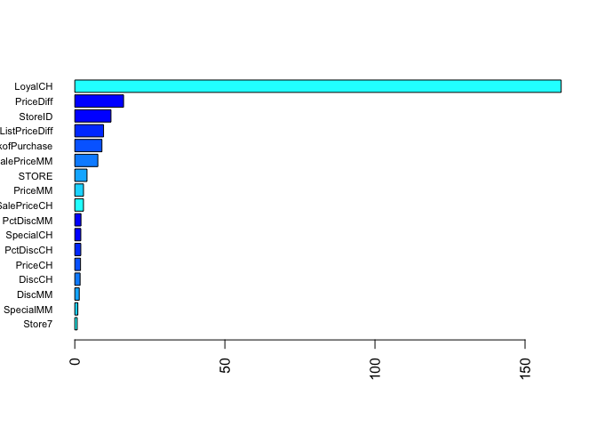

Variable importance is measured based on permutation and node impurity. Based on both criteria, `LoyalCH` is the most important variable, followed by `PriceDiff`. However, the rankings of other important variables are different.

### (b) Boosting

#### Binomial loss

``` r
gbmB.grid <- expand.grid(n.trees = c(500,1000,1500,2000),
                        interaction.depth = 2:5,
                        shrinkage = c(0.001,0.002,0.003,0.004),
                        n.minobsinnode = 1)
set.seed(1)
# Binomial loss function
gbmB.fit <- train(Purchase~., train_df, 
                 tuneGrid = gbmB.grid,
                 trControl = ctrl,
                 method = "gbm",
                 distribution = "bernoulli",
                 metric = "ROC",
                 verbose = FALSE)
```

``` r
ggplot(gbmB.fit, highlight = TRUE)
```


``` r
gbmB.pred <- predict(gbmB.fit, newdata = test_df, type = "prob")[,1]
class_gbmB = if_else(gbmB.pred > 0.5, 'CH', 'MM')
# Classification error rate
1 - mean(class_gbmB == test_df$Purchase)
```

    ## [1] 0.1814815

The test classification error rate for Boosting using binomial loss function is 0.1814815.

#### AdaBoost

``` r
gbmA.grid <- expand.grid(n.trees = c(2000,3000,4000,5000,6000,7000,8000),
                        interaction.depth = 2:7,
                        shrinkage = c(0.00025,0.0005,0.001,0.002,0.003),
                        n.minobsinnode = 1)
set.seed(1)
# Adaboost loss function
gbmA.fit <- train(Purchase~., train_df,
                 tuneGrid = gbmA.grid,
                 trControl = ctrl,
                 method = "gbm",
                 distribution = "adaboost",
                 metric = "ROC",
                 verbose = FALSE)
```

``` r
ggplot(gbmA.fit, highlight = TRUE)
```

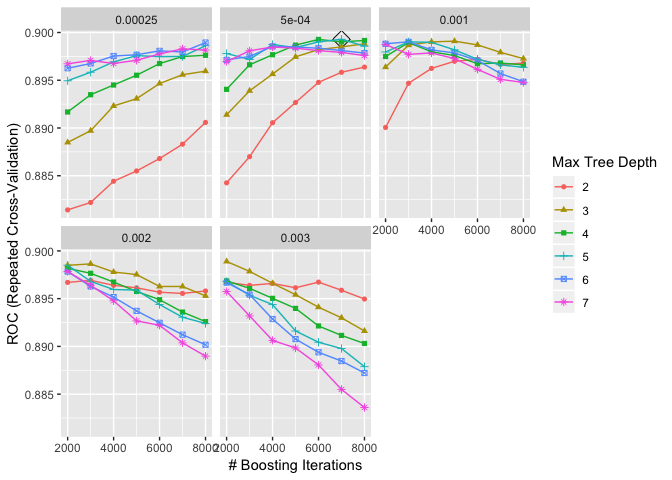

``` r
gbmA.pred <- predict(gbmA.fit, newdata = test_df, type = "prob")[,1]
class_gbmA = if_else(gbmA.pred > 0.5, 'CH', 'MM')
# Classification error rate
1 - mean(class_gbmA == test_df$Purchase)
```

    ## [1] 0.1814815

The test classification error rate for AdaBoost is 0.1814815.

##### Variable Importance

``` r
summary(gbmB.fit$finalModel, las = 2, cBars = 19, cex.names = 0.6)
```

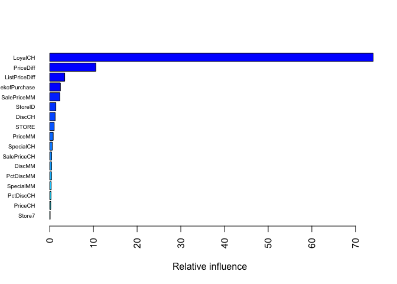

    ##                           var     rel.inf
    ## LoyalCH               LoyalCH 74.03646807
    ## PriceDiff           PriceDiff 10.54118207
    ## ListPriceDiff   ListPriceDiff  3.43269711
    ## WeekofPurchase WeekofPurchase  2.43544276
    ## SalePriceMM       SalePriceMM  2.30936200
    ## StoreID               StoreID  1.40611528
    ## DiscCH                 DiscCH  1.23481297
    ## STORE                   STORE  1.02133925
    ## PriceMM               PriceMM  0.79686407
    ## SpecialCH           SpecialCH  0.59778377
    ## SalePriceCH       SalePriceCH  0.42502226
    ## DiscMM                 DiscMM  0.41821767
    ## PctDiscMM           PctDiscMM  0.40207339
    ## SpecialMM           SpecialMM  0.32987293
    ## PctDiscCH           PctDiscCH  0.28454672
    ## PriceCH               PriceCH  0.22858606
    ## Store7                 Store7  0.09961362

``` r
summary(gbmA.fit$finalModel, las = 2, cBars = 19, cex.names = 0.6)
```

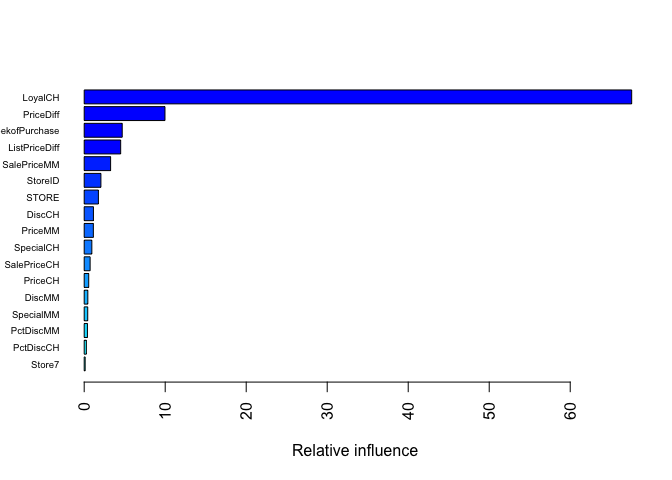

    ##                           var    rel.inf
    ## LoyalCH               LoyalCH 67.5869286
    ## PriceDiff           PriceDiff  9.9717208
    ## WeekofPurchase WeekofPurchase  4.6930619
    ## ListPriceDiff   ListPriceDiff  4.5027628
    ## SalePriceMM       SalePriceMM  3.2599750
    ## StoreID               StoreID  2.0625895
    ## STORE                   STORE  1.7529434
    ## DiscCH                 DiscCH  1.1395674
    ## PriceMM               PriceMM  1.1298130
    ## SpecialCH           SpecialCH  0.9436085
    ## SalePriceCH       SalePriceCH  0.7309452
    ## PriceCH               PriceCH  0.5581945
    ## DiscMM                 DiscMM  0.4478603
    ## SpecialMM           SpecialMM  0.4359267
    ## PctDiscMM           PctDiscMM  0.3997348
    ## PctDiscCH           PctDiscCH  0.2662920
    ## Store7                 Store7  0.1180754

Variable importance plots using Binomial loss function and AdaBoost are reported above.
