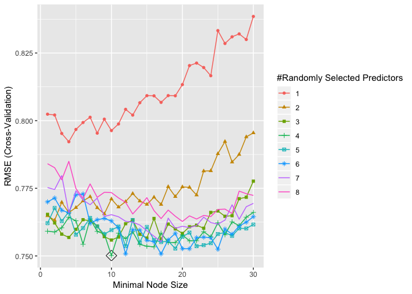
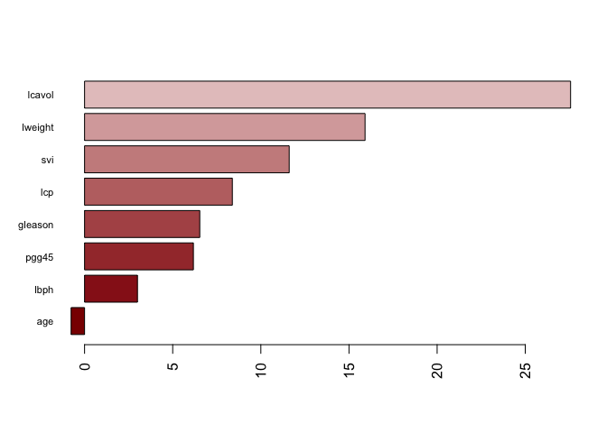
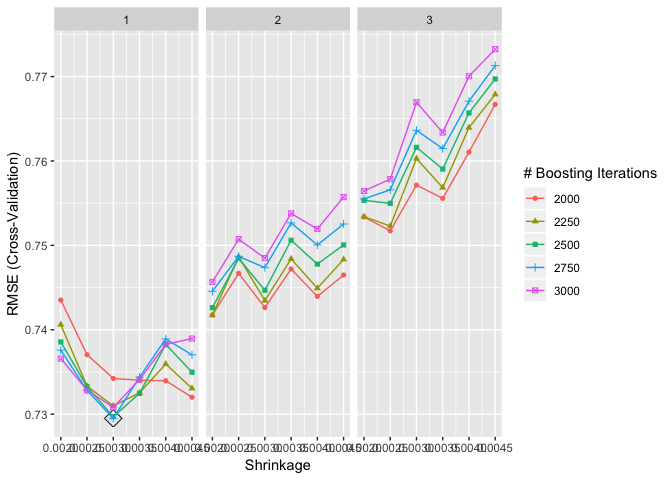
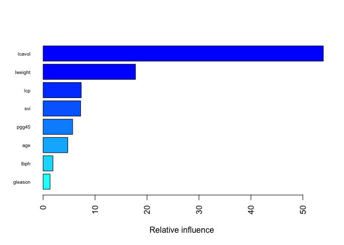

P8106\_hw4\_xy2395
================
Jack Yan
4/16/2019

``` r
knitr::opts_chunk$set(echo = TRUE)
library(tidyverse) # data manipulation
library(lasso2) # data Problem 1
library(ISLR) # data Problem 2
library(rpart) # CART
library(rpart.plot)
library(caret)
library(ranger) # much faster
```

    ## Warning: package 'ranger' was built under R version 3.5.2

Problem 1
=========

### (a)

Fit a regression tree with lpsa as the response and the other variables as predictors.

``` r
set.seed(1)
data(Prostate)
tree_rpart = rpart(lpsa~., data = Prostate, cp = 0) 
rpart.plot(tree_rpart)
```


``` r
cpTable <- printcp(tree_rpart) 
```

    ## 
    ## Regression tree:
    ## rpart(formula = lpsa ~ ., data = Prostate, cp = 0)
    ## 
    ## Variables actually used in tree construction:
    ## [1] lcavol  lweight pgg45  
    ## 
    ## Root node error: 127.92/97 = 1.3187
    ## 
    ## n= 97 
    ## 
    ##         CP nsplit rel error  xerror     xstd
    ## 1 0.347108      0   1.00000 1.01687 0.163742
    ## 2 0.184647      1   0.65289 0.89137 0.112926
    ## 3 0.059316      2   0.46824 0.81363 0.111838
    ## 4 0.034756      3   0.40893 0.70667 0.092263
    ## 5 0.034609      4   0.37417 0.70171 0.090879
    ## 6 0.021564      5   0.33956 0.69128 0.090257
    ## 7 0.021470      6   0.31800 0.67139 0.080849
    ## 8 0.000000      7   0.29653 0.64018 0.081282

``` r
plotcp(tree_rpart)
```


``` r
minErr <- which.min(cpTable[,4]); minErr
```

    ## 8 
    ## 8

``` r
one_se = cpTable[cpTable[,4] < cpTable[minErr,4] + cpTable[minErr,5],1][1]
```

Tree size 8 corresponds to the lowest cross-validation error. The tree size obtained by 1SE rule is 4, so they are not the same.

### (b)

Create a plot of the final tree.

``` r
# use 1SE rule
tree_pruned = prune(tree_rpart, cp = one_se)
rpart.plot(tree_pruned)
```


1 SE rule was used to prune the regression tree. We got a tree with size 4. The interpretation of the rightmost terminal node is that for observations with `lcavol` (log cancer volume) &gt;= 2.5, the value of response (log prostate specific antigen) is predicted to be 3.8.

### (c) Bagging

``` r
# For bagging, don't have to tune
# fit the bagging model
bagging <- ranger(lpsa~., Prostate,
                  mtry = 8,
                  importance = "permutation",
                  min.node.size = 25,
                  scale.permutation.importance = TRUE)
barplot(sort(ranger::importance(bagging), decreasing = FALSE), 
        las = 2, horiz = TRUE, cex.names = 0.7,
        col = colorRampPalette(colors = c("darkred","white","darkblue"))(19))
```


### (d) Random Forest

``` r
set.seed(1)
ctrl <- trainControl(method = "cv")
# Tune the Random Forest model
rf.grid <- expand.grid(mtry = 1:8, 
                       splitrule = "variance",
                       min.node.size = 1:30)
rf.fit <- train(lpsa~., Prostate,
                method = "ranger",
                tuneGrid = rf.grid,
                trControl = ctrl)

rf.fit$bestTune
```

    ##     mtry splitrule min.node.size
    ## 100    4  variance            10

``` r
ggplot(rf.fit, highlight = TRUE)
```

    ## Warning: The shape palette can deal with a maximum of 6 discrete values
    ## because more than 6 becomes difficult to discriminate; you have 8.
    ## Consider specifying shapes manually if you must have them.

    ## Warning: Removed 60 rows containing missing values (geom_point).



``` r
# Fit a random forest model using the best tuning parameters
rf <- ranger(lpsa~., Prostate,
             mtry = 4,
             min.node.size = 18,
             importance = "permutation",
             scale.permutation.importance = TRUE)
barplot(sort(ranger::importance(rf), decreasing = FALSE), 
        las = 2, horiz = TRUE, cex.names = 0.7,
        col = colorRampPalette(colors = c("darkred","white","darkblue"))(19))
```



### (e) Boosting

``` r
set.seed(1)
# Tune the boosting model
gbm.grid <- expand.grid(n.trees = c(2000,2250,2500,2750,3000),
                        interaction.depth = 1:3,
                        shrinkage = c(0.002, 0.0025, 0.003, 0.0035, 0.004, 0.0045),
                        n.minobsinnode = 1)

gbm.fit <- train(lpsa~., Prostate,
                 method = "gbm",
                 tuneGrid = gbm.grid,
                 trControl = ctrl,
                 verbose = FALSE)

ggplot(gbm.fit, highlight = TRUE)
```



``` r
gbm.fit$bestTune
```

    ##    n.trees interaction.depth shrinkage n.minobsinnode
    ## 34    2750                 1     0.003              1

``` r
# variable importance
summary(gbm.fit$finalModel, las = 2, cBars = 19, cex.names = 0.6)
```



    ##             var   rel.inf
    ## lcavol   lcavol 53.944001
    ## lweight lweight 17.789971
    ## lcp         lcp  7.348102
    ## svi         svi  7.231260
    ## pgg45     pgg45  5.688176
    ## age         age  4.748732
    ## lbph       lbph  1.902119
    ## gleason gleason  1.347638

### (e) Comparing models

``` r
resamp <- resamples(list(rf = rf.fit, gbm = gbm.fit))
summary(resamp)
```

    ## 
    ## Call:
    ## summary.resamples(object = resamp)
    ## 
    ## Models: rf, gbm 
    ## Number of resamples: 10 
    ## 
    ## MAE 
    ##          Min.   1st Qu.    Median      Mean   3rd Qu.      Max. NA's
    ## rf  0.4648123 0.5532836 0.5923967 0.6228087 0.6289865 0.9996566    0
    ## gbm 0.4131232 0.4923112 0.5553602 0.5998126 0.6677754 0.8791101    0
    ## 
    ## RMSE 
    ##          Min.   1st Qu.    Median      Mean   3rd Qu.      Max. NA's
    ## rf  0.5069939 0.6481243 0.7445905 0.7501187 0.8306560 1.1044344    0
    ## gbm 0.5009410 0.6556242 0.6982477 0.7295008 0.7876015 0.9928077    0
    ## 
    ## Rsquared 
    ##          Min.   1st Qu.    Median      Mean   3rd Qu.      Max. NA's
    ## rf  0.2238620 0.5884224 0.6716335 0.6285596 0.7076104 0.7970210    0
    ## gbm 0.3692619 0.5890270 0.6976697 0.6500616 0.7397627 0.7964835    0

``` r
ggplot(resamp) + theme_bw()
```

 Bagging is a special case of random forest in which mtry = total number of predictors = 8. According to the tuning of random forest, the best mtry = 4, so apparently random forest is better than bagging.

Here we compare the cross-validation RMSE of random forest and boosting. I will choose the boosting model to predict PSA level, because boosting has lower cross-validation RMSE than that of random forest, indicating the best prediction accuracy.

Problem 2
=========

Create a training set containing a random sample of 800 observations, and a test set containing the remaining observations. Use set.seed() for reproducible results.

``` r
data(OJ)
oj = as.tibble(OJ)

#split the data into training and test sets
set.seed(1)
train_df = sample_n(oj, 800) 
test_df = anti_join(oj, train_df)
```

### (a)
