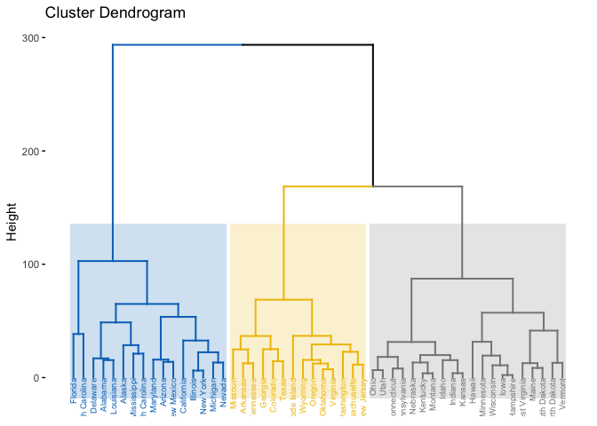
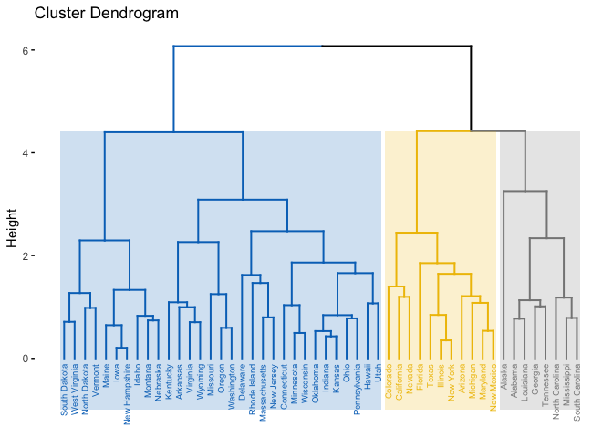

P8106\_hw6\_xy2395
================
Jack Yan
4/30/2019

``` r
library(tidyverse) # data manipulation
library(caret) # model tuning
library(ISLR) # data Question 1
library(factoextra) # Visualization
library(jpeg) # Question 2
```

Cluster analysis
================

``` r
data(USArrests)
head(USArrests)
```

    ##            Murder Assault UrbanPop Rape
    ## Alabama      13.2     236       58 21.2
    ## Alaska       10.0     263       48 44.5
    ## Arizona       8.1     294       80 31.0
    ## Arkansas      8.8     190       50 19.5
    ## California    9.0     276       91 40.6
    ## Colorado      7.9     204       78 38.7

#### (a) Using hierarchical clustering with complete linkage and Euclidean distance, cluster the states.

``` r
hc.complete <- hclust(dist(USArrests), method = "complete")
```

#### (b) Cut the dendrogram at a height that results in three distinct clusters. Which states belong to which clusters?

``` r
fviz_dend(hc.complete, k = 3, 
          cex = 0.5,
          palette = "jco",
          color_labels_by_k = TRUE,
          rect = TRUE, rect_fill = TRUE, rect_border = "jco",
          labels_track_height = 18) 
```



``` r
ind4.complete <- cutree(hc.complete, 3)

# Who are in the fourth cluster?
USArrests[ind4.complete == 1, ] %>% rownames() # cluster 1
```

    ##  [1] "Alabama"        "Alaska"         "Arizona"        "California"    
    ##  [5] "Delaware"       "Florida"        "Illinois"       "Louisiana"     
    ##  [9] "Maryland"       "Michigan"       "Mississippi"    "Nevada"        
    ## [13] "New Mexico"     "New York"       "North Carolina" "South Carolina"

``` r
USArrests[ind4.complete == 2, ] %>% rownames() # cluster 2
```

    ##  [1] "Arkansas"      "Colorado"      "Georgia"       "Massachusetts"
    ##  [5] "Missouri"      "New Jersey"    "Oklahoma"      "Oregon"       
    ##  [9] "Rhode Island"  "Tennessee"     "Texas"         "Virginia"     
    ## [13] "Washington"    "Wyoming"

``` r
USArrests[ind4.complete == 3, ] %>% rownames() # cluster 3
```

    ##  [1] "Connecticut"   "Hawaii"        "Idaho"         "Indiana"      
    ##  [5] "Iowa"          "Kansas"        "Kentucky"      "Maine"        
    ##  [9] "Minnesota"     "Montana"       "Nebraska"      "New Hampshire"
    ## [13] "North Dakota"  "Ohio"          "Pennsylvania"  "South Dakota" 
    ## [17] "Utah"          "Vermont"       "West Virginia" "Wisconsin"

#### (c) Hierarchically cluster the states using complete linkage and Euclidean distance, after scaling the variables to have standard deviation one.

``` r
USArrests_scaled = scale(USArrests) %>% as.data.frame()
hc.complete2 <- hclust(dist(USArrests_scaled), method = "complete")
fviz_dend(hc.complete2, k = 3, 
          cex = 0.5,
          palette = "jco",
          color_labels_by_k = TRUE,
          rect = TRUE, rect_fill = TRUE, rect_border = "jco",
          labels_track_height = 0.5) 
```



``` r
ind4.complete <- cutree(hc.complete, 3)
```

#### (d) What effect does scaling the variables have on the hierarchical clustering obtained? In your opinion, should the variables be scaled before the inter-observation dissimilarities are computed?

Scaling results in different clustering of the states. I think the variables should be scaled because the original variables are in different magnitudes. For example, `Assault` is in hundreds and `Murder` is no more than 20. If we did not scale the variables, `Assault` would exert a much higher influence on clustering compared to other variables.

PCA
===

This is the original image:

``` r
img <- readJPEG("./lion.jpg")

```


``` r
dim(img)
```

    ## [1] 340 561   3

``` r
r <- img[,,1]
g <- img[,,2]
b <- img[,,3]
img.r.pca <- prcomp(r, center = FALSE)
img.g.pca <- prcomp(g, center = FALSE)
img.b.pca <- prcomp(b, center = FALSE)

rgb.pca <- list(img.r.pca, img.g.pca, img.b.pca)

# Approximate X with XV_kV_k^T
compress <- function(pr, k)
{
  compressed.img <- pr$x[,1:k] %*% t(pr$rotation[,1:k])
  compressed.img
}

# Using first 50 PCs
pca50 <- sapply(rgb.pca, compress, k = 50, simplify = "array")
writeJPEG(pca50, "pca50.jpeg")

```


``` r
# Using first 100 PCs
pca100 <- sapply(rgb.pca, compress, k = 100, simplify = "array")
writeJPEG(pca100, "pca100.jpeg")

```


``` r
# Using first 200 PCs
pca200 <- sapply(rgb.pca, compress, k = 200, simplify = "array")
writeJPEG(pca200, "pca200.jpeg")

```


``` r
# Using first 300 PCs
pca300 <- sapply(rgb.pca, compress, k = 300, simplify = "array")
writeJPEG(pca300, "pca300.jpeg")

```


The image becomes more clear with increasing number of PCs.
